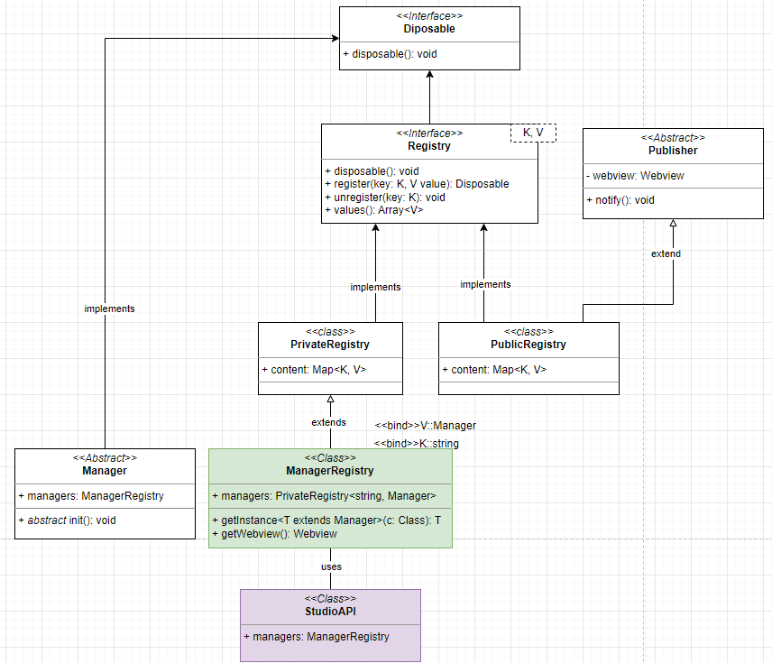
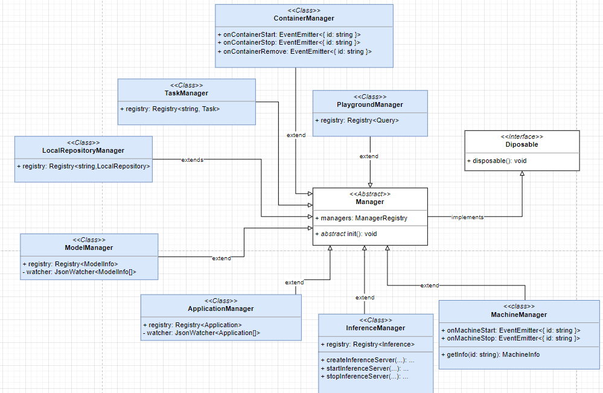

## Motivation

In today implementation our _managers_ tends to have too much dependencies on each other, making them hard to tests.

The example case is, adding a new feature in one manager, we have to refactor the tests of all the classes using it, same for registries.

Moreover, we are initializing all the managers in the extension activate, which can be heavy, and decrease the performance of the Podman-Desktop application.

## Solution

We should introduce a `ManagerRegistry`. This class should be responsible for the lifecycle of the managers.



Inside the StudioAPI we can have an instance of the `ManagerRegistry` and calling the `getInstance` for each manager we require when the api is triggered.

````ts
import type { ModelsManager } from './modelsManager';

... 

async getModelsDirectory(): Promise <string> {
  return this.managers.getInstance(ModelsManager).getModelsDirectory();
}
````

Having this architecture would allow to lazy init all the managers. The instances of each of them does not exist until we need them.

### Implementation example

Here is a short example of what the ManagerRegistry could look like.
````ts
import { PrivateRegistry } from './PrivateRegistry';
import type { AbstractManager } from '../utils/AbstractManager';

export class ManagerRegistry extends PrivateRegistry<string, AbstractManager> {
  constructor(public readonly webview: Webview) {
    super();
  }

  public getInstance<T extends AbstractManager>(c: { new(managers: ManagerRegistry): T }): T {
    // Check if we have an existing instance
    let instance = this.get(c.name);
    // If not we create it
    if (instance === undefined) {
      instance = new c(this);
      // We init the manager
      instance.init();
      // We register it
      this.register(c.name, instance);
    }
    return instance as T;
  }

  // When disposing, we dispose all managers
  public override dispose(): void {
    this.values().forEach(manager => manager.dispose());
    super.dispose();
  }
}
````
### Implication for registries

Registries should be like the Manager, be singleton, therefore we should simplify the registries, as shown in the UML, we could have `PrivateRegistry` and `PublicRegistry` meaning, the public one would automatically post to the webview its content when updated.
We could simplify **a lot** the code by having more abstraction.



### Implication for testing

When we test a manager, we can easily mockup the ManagerRegistry, and providing our mockup instead of the full manager.
This would be easier for unit testing, as we would not imports all the managers dependencies each time we want to test one, only its type.
